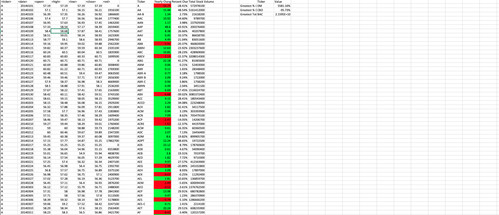
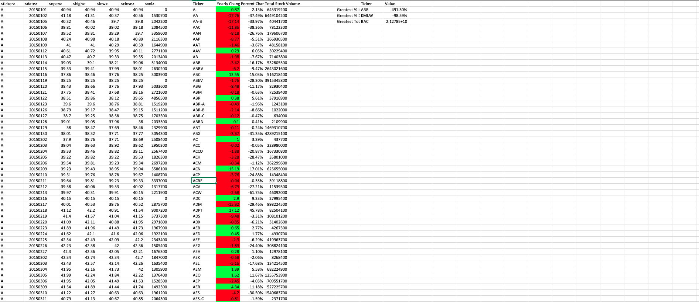
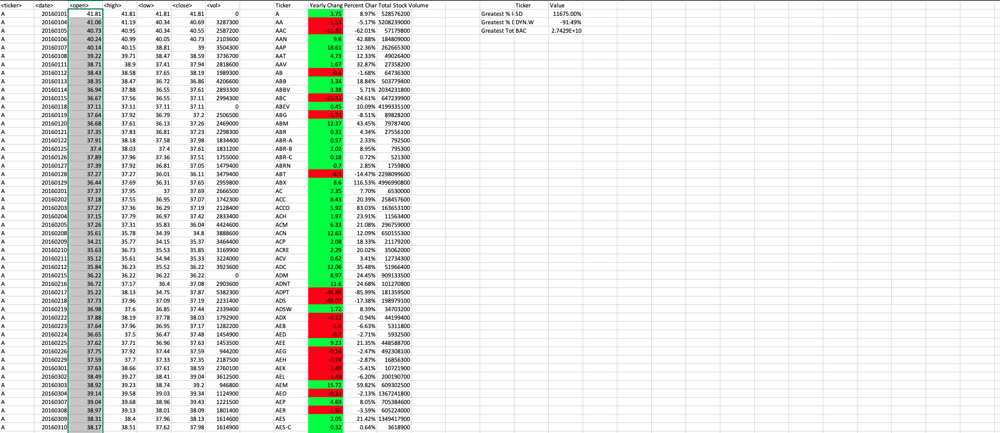

# VBA Homework - VBA Challenge

## Link to VBS Code
* [VBS Code](https://github.com/jussstinpot/UCI-Homework-Justin-Pot/blob/master/02-vba-challenge/Yearly_stock.vbs)
#
# Worksheet Findings

# VBA Screen Shot for 2014
#### Summary of 2014
* Greatest % Increase:
    * Ticker: DM
    * Value: 5581.16%
* Greatest % Decrease:
    * Ticker: CBO
    * Value: -95.73%
* Greatest Total Volume: BAC 
    * Ticker: BAC
    * Value: 2.1595E+10

#
# VBA Screen Shot for 2015
#### Summary of 2015
* Greatest % Increase:
    * Ticker: ARR
    * Value: 491.30%
* Greatest % Decrease:
    * Ticker: KMI.W
    * Value: -98.59%
* Greatest Total Volume:
    * Ticker: BAC
    * Value: 2.1278E+10

#
# VBA Screen Shot for 2016
#### Summary of 2014
* Greatest % Increase:
    * Ticker: SD
    * Value: 11675.00%
* Greatest % Decrease:
    * Ticker: DYN.W
    * Value: -91.49%
* Greatest Total Volume: 
    * Ticker: BAC
    * Value: 2.7429E+10

### Copyright
Justin Pot © 2020. All Rights Reserved.

